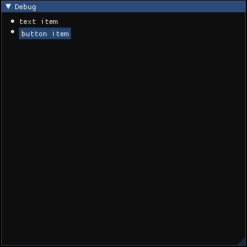

通常按钮控件都会在被点击或按下时返回true。

#### 正常按钮

`ImGui::Button(label, size)`，普通按钮。

`ImGui::SmallButton(label)`，小型按钮（边框为0，可以方便嵌入文本中）。

`ImGui::InvisibleButton(str_id, size, flags)`，不可见按钮。

>   参数：
>
>   *   `str_id`，唯一标识。
>   *   `flags`，鼠标响应按键（默认只响应左键）。
>       *   `ImGuiButtonFlags_MouseButtonLeft`，响应左键。
>       *   `ImGuiButtonFlags_MouseButtonRight`，响应右键。
>       *   `ImGuiButtonFlags_MouseButtonMiddle`，响应中键。

`ImGui::ArrowButton(str_id, dir)`，带箭头的按钮。

---

#### 单选按钮

`ImGui::RadioButton(lable, ...)`，单选按钮。

>   `ImGui::RadioButton(label, active)`，按钮默认不会实现选中或非选中操作，需要通过设置`active`表示其是否选中。
>
>   *   示例：
>
>       ```cpp
>       if (ImGui::RadioButton("btn1", value == 1)) {
>           value = 1;
>       }
>       if (ImGui::RadioButton("btn2", value == 2)) {
>           value = 2;
>       }
>       ```
>
>   `ImGui::RadioButton(label, v_ptr, v_btn)`，当按钮值为整数时的快捷用法。
>
>   *   示例：
>
>       ```cpp
>       ImGui::RadioButton("btn1", &value, 1);
>       ImGui::RadioButton("btn2", &value, 2);
>       ```

---

#### 复选按钮

`ImGui::Checkbox(lable, v_ptr)`，复选按钮。

`ImGui::CheckboxFlags(lable, flags_ptr, v_flag)`，带标记位的复选框，通过位运算设置标记值。

>   示例：
>
>   ```cpp
>   ImGui::CheckboxFlags("btn1", &value, 1 << 0);
>   ImGui::CheckboxFlags("btn2", &value, 1 << 1);
>   ImGui::CheckboxFlags("btn3", &value, 1 << 2);
>   ImGui::CheckboxFlags("btn4", &value, 1 << 3);
>   ```

---

#### 进度条

`ImGui::ProgressBar(frac, size, overlay)`，进度条。

>   参数：
>
>   *   `frac`，进度条进度，0~1。
>   *   `overlay`，进度条上覆盖的文字。

---

#### 项目符号

`ImGui::Bullet`，在后续组件前加上绘制一个圆点。

>   实例：
>
>   ```cpp
>   ImGui::Bullet();
>   ImGui::Text("text item");
>   ImGui::Bullet();
>   ImGui::Button("button item");
>   ```
>
>   